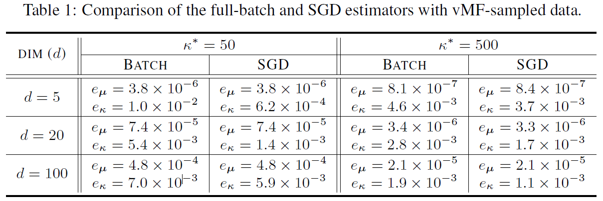

# Python/PyTorch Implementation of von Mises-Fisher and Its Mixture

The von Mises-Fisher (vMF) is a well-known density model for directional random variables. The recent surge of the deep embedding methodologies for high-dimensional structured data such as images or texts, aimed at extracting salient directional information, can make the vMF model even more popular. In this article, we will review the vMF model and its mixture, provide detailed recipes of how to train the models, focusing on the  maximum likelihood estimators, in Python/PyTorch. In particular, implementation of vMF typically suffers from the notorious numerical issue of the Bessel function evaluation in the density normalizer, especially when the dimensionality is high, and we address the issue using the MPMath library that supports arbitrary precision. For the mixture learning, we provide both  minibatch-based large-scale SGD learning, as well as the EM algorithm which is a full batch estimator. For each estimator/methodology, we test our implementation on some synthetic data, while we also demonstrate the use case in a more realistic scenario of image clustering. The technical report for the details can be found in https://arXiv...

---


## Features

* vMF density estimation via near-closed-form Maximum Likelihood Estimator (MLE) or Stochastic Gradient Descent (SGD)
* Estimation of mixture of vMFs via Expectation-Maximization (EM) or SGD
* Numerically stable estimation of the vMF normalizer through [mpmath](https://mpmath.org/)'s Bessel function estimation
* Examples of image clustering application


## Requirements

* Python 3.7
* PyTorch >= 1.4.0
* NumPy >= 1.18.1
* [mpmath](https://mpmath.org/) >= 1.1.0
* scikit-learn >= 0.23.2 (Required for metric computation in image clustering)


## Usage examples

### vMF Density Estimation

We generate samples from a true vMF model, and aim to estimate the true model parameters by either the near-closed-form MLE or the SGD estimators. See the demo code in ```mle_for_vmf.py``` for the details. The results are briefly summarized in the following table. 

<p align="center">
  
</p>


## Citation
If you found this library useful in your research, please cite:
```
@article{mkim2021vmf,
  title={On PyTorch Implementation of Density Estimators for von Mises-Fisher and Its Mixture},
  author={Kim, Minyoung},
  journal={arxiv...},
  year={2021}
}
```


